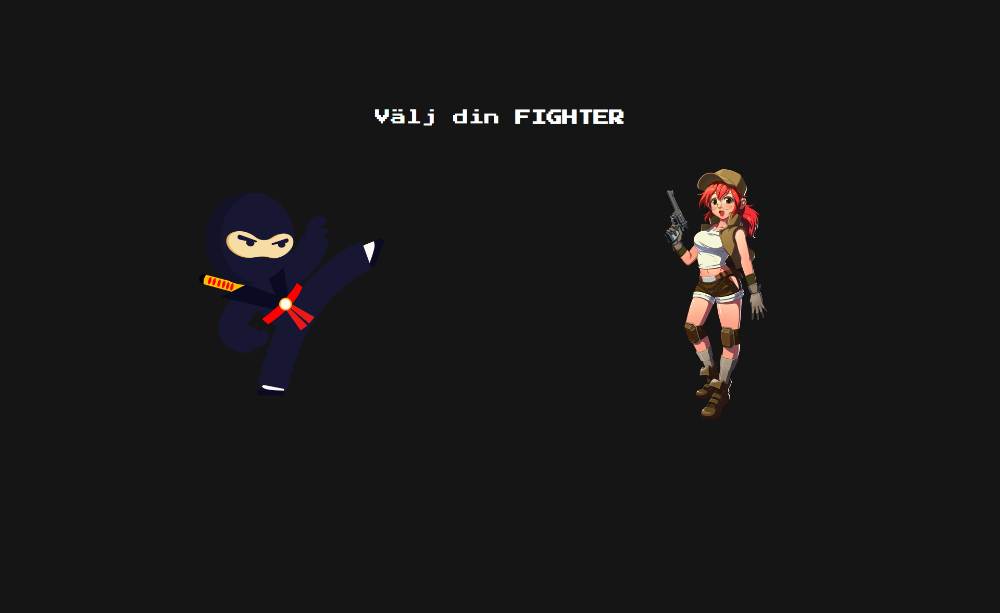

# FIGHTING GAME

Här är min [Demo Sida](https://frontfelix.github.io/Labb-1/).

## Uppgfiten
Uppgiften gick ut att göra en textbaserad upplevelse där användaren själv kan välja vad den ska göra på hemsidan, t.ex göra ett spel eller en story som användaren kan styra med inputs och knappar.

## Hur jag har skapat det

1. Användaren får välja mellan två karaktärer att "spela" med, en tjej med pistol eller en ninja med "svärd"
2. Användaren får sedan skriva in ett namn och ålder på sin karaktär som sedan sparas i variabler
3. Användaren åker sedan vidare till "fighting scene" där dem får välja att "slåss" mot vargen eller försöka bli "vän" med vargen och beroende på val så antingen vinner dem eller förlorar dem.
4. Avslutar med att spelet går tillbaka till start screen och låter användaren börja om, med hjälp av en timer på 8sekunder.

